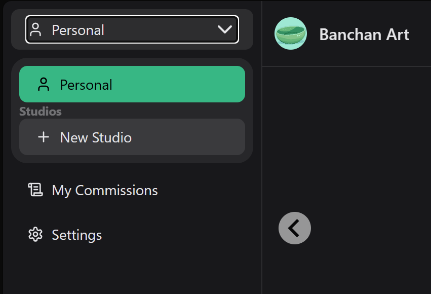

# Studio Guide

When you initially register for an account on Banchan Art, it allows you to submit proposals to studios for commissions. If you are an artists, you will need beta access to open a studio.

> A **studio** is any place where an artist works. Here we use it to describe the place where an artist sets up their shop, gallery, and branding.

## Creating a Studio

Pre-requisite: this guide assumes you have already registered for an account and are signed in. The beta invite will add permissions to your account to open a studio. If you have not registered for an account, [then please click here to do so.](https://banchan.art/register)

### Step 1

Go to <https://banchan.art/beta> and sign up for beta access.

### Step 2

Wait for an invite email. These are sent as invites become available.

### Step 3

Once you receive your email, you can click the link to grant you artist privileges on the site. This link can only be used on a single user.

### Step 4

Back on the website, you should now see a new area on the left-side navigation, with an option to create a new studio:

Clicking on New Studio will take you to the Studio Creation page, where you can configure your Studio details.

- Mature configures whether all your offerings will be NSFW/mature. If only some of them will be, you don't need to check this.
- Set your country based on your location of residence and/or where you have an active bank account. This is where your Stripe account will be created.
- Default Currency and Currencies configure what currencies your offerings will be able to visibly use as their presentation currencies. You will still be able to accept payment from any of the 140+ supported currencies even if you do not configure them here.

### Step 5

After this studio is created, there is additional configuration to do before your studio is fully ready. Navigate to your Studio page, which should be available through the top-left nav now, and go to Edit Profile.

- Onboard with Stripe in order to set up your payment details
  - This will include setting up your contact information and linking your bank account in order to be paid.
- In this page, you should configure the remaining fields: Card Image, Gallery Images, and About are the most important ones. Filling these out is required before your studios and offerings will show up on the Home and Discover pages.

## Setting up Commission Offerings

## Reviewing Proposals

## Managing Commissions

## Payouts

## Additional information about Studios

Right now we only have single artist studios. We are planning to later add multi-artist studios in the future.

An artist can set up multiple studios, which allows them to have separate studios if they have multiple brands. One use case would be if they would like to separate SFW and NSFW commission offerings.
